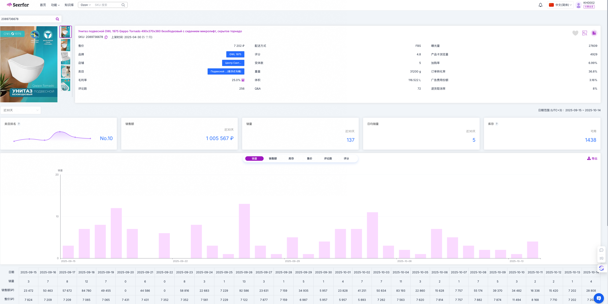

## AI选品系统流程

## 概述

本文档描述了基于RPA和AI技术的自动化选品系统的完整工作流程，涵盖从环境准备到商品采集完成的全过程。

## 系统架构

- **RPA引擎**: 影刀RPA软件
- **数据源**: Ozon、Seefar、1688等电商平台
- **AI服务**: 大模型多模态相似度判断
- **插件依赖**: 电鹏Ozon插件、影刀插件、Seefar插件

## 详细流程

### 1. 环境准备阶段

#### 1.1 插件环境检查

确保以下插件已正确安装并登录：

- **电鹏Ozon插件**: 用于获取Ozon商品信息
- **影刀插件**: RPA自动化执行
- **Seefar插件**: 店铺和商品数据查询

#### 1.2 用户准备工作

- 准备计算器文件
- 准备好店列表文件
- 准备商品采集模板文件

#### 1.3 启动RPA系统

在影刀RPA软件中找到对应的小程序并启动

### 2. 系统初始化

#### 2.1 参数配置

系统初始化时需要的全局变量：

- **用户本地的临时目录**: tmp_dir， 用于存取本地图片、或临时文件
- **Ozon店铺URL模板**: `https://www.ozon.run/product/{ozon_shop_id}`
- **Seefar店铺查询URL模板**: `https://seerfar.cn/admin/store-detail.html?storeId=${ozon_shop_id}&platform=OZON`
- **seefar SKU详情查询模版**: `https://seerfar.cn/admin/product-detail.html?platform=OZON&sku=${ozon_product_sku}`
  - 
- **全局店铺计数**: `total_shop_count`
- **全局商品计数**: `total_product_count`

#### 2.2 UI输入

弹出RPA操作界面，准备开始自动化流程,UI的代码如下，
VariableName 为具体的变量名称，用于后续步骤中引用

```json

{
  "dialogTitle": null,
  "height": 0,
  "width": 0,
  "timeout": 0,
  "autoCloseButton": "确定",
  "use_wait_timeout": false,
  "canRememberContent": false,
  "settings": {
    "editors": [
      {
        "type": "File",
        "label": "好店模版文件",
        "VariableName": "good_shop_file",
        "kind": 0,
        "filter": "Excel文件|*.xls;*.xlsx",
        "value": null,
        "nullText": "请选择路径",
        "id": "78b1c0db-ba08-42ac-a1ca-5cc08ebf2a0a"
      },
      {
        "type": "File",
        "label": "采品文件",
        "VariableName": "item_collect_file",
        "kind": 0,
        "filter": "Excel文件|*.xls;*.xlsx",
        "value": null,
        "nullText": "请选择商品",
        "id": "942d257e-dfa0-4a7a-a288-fc71ff1e8ebc"
      },
      {
        "type": "File",
        "label": "计算器文件",
        "VariableName": "margin_calculator",
        "kind": 0,
        "filter": "Excel文件|*.xls;*.xlsx",
        "value": null,
        "nullText": "请选择路径",
        "id": "b4e7f737-5f50-44d9-8818-108c835bd03c"
      },
      {
        "type": "Number",
        "label": "利润率大于等于",
        "VariableName": "margin",
        "value": 0.1,
        "maxValue": null,
        "minValue": null,
        "useFloat": true,
        "id": "c4cd95ce-0d3a-4180-991e-db85ca954e01"
      },
      {
        "type": "Number",
        "label": "商品创建天数小于等于",
        "VariableName": "item_created_days",
        "value": 150,
        "maxValue": null,
        "minValue": null,
        "useFloat": false,
        "id": "b67f4761-ffae-4685-9dad-c10546534e72"
      },
      {
        "type": "Number",
        "label": "跟卖数量小于",
        "VariableName": "follow_buy_cnt",
        "value": 37,
        "maxValue": null,
        "minValue": null,
        "useFloat": true,
        "id": "66ab9a00-643e-4101-9d8a-836c57553742"
      },
      {
        "type": "Number",
        "label": "月销量大于等于",
        "VariableName": "max_monthly_sold",
        "value": 0,
        "maxValue": null,
        "minValue": null,
        "useFloat": false,
        "id": "3baba30f-9158-4df4-a21b-e0a5b969c139"
      },
      {
        "type": "Number",
        "label": "月销量小于等于",
        "VariableName": "monthly_sold_min",
        "value": 100,
        "maxValue": null,
        "minValue": null,
        "useFloat": false,
        "id": "7edad03b-65ec-4d35-b074-bb4896af89c8"
      },
      {
        "type": "Number",
        "label": "商品最小重量（g）",
        "VariableName": "item_min_weigt",
        "value": 0,
        "maxValue": null,
        "minValue": null,
        "useFloat": false,
        "id": "1dfd29e5-2ee7-41af-88b3-28bed5438b43"
      },
      {
        "type": "Number",
        "label": "商品最大数量（g）",
        "VariableName": "item_max_weight",
        "value": 1000,
        "maxValue": null,
        "minValue": null,
        "useFloat": false,
        "id": "f86d2e3d-9d8f-4546-9d32-12816fe14c11"
      },
      {
        "type": "Number",
        "label": "G01商品最小售价（₽）",
        "VariableName": "g01_item_min_price",
        "value": 0,
        "maxValue": null,
        "minValue": null,
        "useFloat": false,
        "id": "52f9ccf8-d054-464f-ab78-868354969dc7"
      },
      {
        "type": "Number",
        "label": "G01商品最大售价（₽）",
        "VariableName": "g01_item_max_price",
        "value": 1000,
        "maxValue": null,
        "minValue": null,
        "useFloat": false,
        "id": "cd7bcd90-9570-4392-b199-684d82cf35fb"
      }
    ],
    "buttons": [
      {
        "type": "Button",
        "label": "确定",
        "theme": "white",
        "hotKey": "Return",
        "id": "92c4e7ff-a302-4949-861f-f3c848b0ba97"
      },
      {
        "type": "Button",
        "label": "取消",
        "theme": "white",
        "hotKey": "Escape",
        "id": "25d8b975-1b18-4d1c-a656-93c4eb8de9fe"
      }
    ]
  }
}

```

### 3. 店铺处理循环

#### 3.1 店铺筛选

- 读取good_shop_file， 读取好店列表
- 剔除已标记为"完成"的店铺
- 开始店铺ID循环处理

#### 3.2 店铺质量评估

- 在Seefar页面读取店铺详情
- 根据预设规则计算是否为好店
- 如不符合标准，跳过商品采集流程并标记为"完成"

#### 3.3 商品列表获取

- 通过浏览器打开Seefar店铺查询URL
- 获取商品列表
- 翻页获取所有商品ID

### 4. 商品处理循环

#### 4.1 商品信息采集

循环处理当前店铺下的商品ID列表，逐个打开计算好的Ozon商详URL模板：

**从Seefar插件获取的信息**:

- 商品首链接
- 跟卖数量
- 评价数量
- 销量数据

**从Ozon插件获取的信息**:

- 商品标题
- 商品描述
- 跟卖最低价
- 跟卖最高价

#### 4.2 条件筛选

- 根据预设条件进行判断（AND逻辑关系）
- 不符合条件的商品直接跳过

#### 4.3 图片和货源信息采集

- 下载Ozon商品主图
- 采集货源平台信息（待完善）

#### 4.4 数据回写

- 处理完当前商品后，进行下一个商品
- 直到完成当前店铺的所有商品
- 将符合条件的商品信息回写到Excel文件

### 5. AI智能判断

#### 5.1 批量AI处理

- 调用云端大模型服务
- 进行多模态相似度判断
- 根据设定阈值进行评分

#### 5.2 结果标记

- **符合阈值**: 在Excel文档中的"大模型判断"列标记为"同一商品"
- **不符合阈值**: 标记为"待人工审核"

### 6. 流程完成

#### 6.1 单店铺完成

- 完成当前店铺所有商品采集
- 更新好店Excel状态为"完成"

#### 6.2 全流程完成

- 循环处理下一个店铺
- 直到所有店铺采集完成


## 数据模型

### 变量表
**数据来源**：用户UI输入

| 序号 | 变量名 | 标签 | 类型 | 默认值 | 描述 |
|------|--------|------|------|--------|------|
| 1 | `good_shop_file` | 好店模版文件 | File | null | Excel文件路径，用于存储好店信息 |
| 2 | `item_collect_file` | 采品文件 | File | null | Excel文件路径，用于存储商品采集信息 |
| 3 | `margin_calculator` | 计算器文件 | File | null | Excel文件路径，用于利润计算 |
| 4 | `margin` | 利润率大于等于 | Number | 0.1 | 浮点数，筛选条件：利润率阈值 |
| 5 | `item_created_days` | 商品创建天数小于等于 | Number | 150 | 整数，筛选条件：商品创建时间限制 |
| 6 | `follow_buy_cnt` | 跟卖数量小于 | Number | 37 | 浮点数，筛选条件：跟卖商家数量上限 |
| 7 | `max_monthly_sold` | 月销量大于等于 | Number | 0 | 整数，筛选条件：月销量下限 |
| 8 | `monthly_sold_min` | 月销量小于等于 | Number | 100 | 整数，筛选条件：月销量上限 |
| 9 | `item_min_weigt` | 商品最小重量（g） | Number | 0 | 整数，筛选条件：商品重量下限 |
| 10 | `item_max_weight` | 商品最大重量（g） | Number | 1000 | 整数，筛选条件：商品重量上限 |
| 11 | `g01_item_min_price` | G01商品最小售价（₽） | Number | 0 | 整数，筛选条件：G01商品价格下限 |
| 12 | `g01_item_max_price` | G01商品最大售价（₽） | Number | 1000 | 整数，筛选条件：G01商品价格上限 |


### 店铺数据表
**数据来源**：用户提供的Excel文件（第一个sheet）

| 列序号 | 列名 | Python列名 | 描述 |
|--------|------|------------|------|
| 1 | 店铺ID | `ozon_shop_id` | ozon平台店铺的唯一标识符 |
| 2 | 好店标志 | `good_shop_flag` | 标识是否为优质店铺，值为"是"或"否" |
| 3 | 取数状态 | `data_fetch_status` | 店铺数据获取状态，值为"已取数"或空 |


### 商品采集数据表
**数据来源**：用户提供的Excel文件（`item_collect_file`的第一个sheet）

| 列序号 | 列名 | Python列名 | 描述 |
|--------|------|------------|------|
| 1 | ozon产品名称 | `ozon_product_name` | ozon平台商品的完整名称 |
| 2 | ozon产品SKU | `ozon_product_sku` | ozon平台商品的唯一标识码 |
| 3 | ozon建议售价（¥） | `ozon_suggested_price` | ozon平台建议的销售价格，人民币计价 |
| 4 | ozon链接 | `ozon_link` | ozon平台商品详情页链接地址 |
| 5 | ozon图片 | `ozon_image` | ozon平台商品主图或图片链接 |
| 6 | ozon尺寸 | `ozon_size` | 商品的物理尺寸规格信息 |
| 7 | ozon重量（kg） | `ozon_weight_kg` | 商品重量，以公斤为单位 |
| 8 | ozon月销量 | `ozon_monthly_sales` | ozon平台该商品的月度销售数量 |
| 9 | ozon跟卖数 | `ozon_follow_sellers` | 该商品在ozon平台的跟卖商家数量 |
| 10 | ozon链接上架时间 | `ozon_listing_time` | 商品在ozon平台的首次上架时间 |
| 11 | 1688拿货成本（¥） | `supply_cost_cny` | 从1688平台采购该商品的成本价格 |
| 12 | 1688链接 | `supply_link_1688` | 1688平台对应商品的链接地址 |
| 13 | 1688图片 | `supply_image_1688` | 1688平台商品图片或图片链接 |
| 14 | 大模型结论 | `ai_model_conclusion` | AI大模型对该商品的分析结论 |
| 15 | ozon物流 | `ozon_logistics` | ozon平台的物流配送方式 |
| 16 | 到取货点(元) | `pickup_point_fee` | 配送到取货点的费用，人民币计价 |
| 17 | FBS | `fbs_status` | FBS（Fulfillment by Seller）卖家自发货标识 |
| 18 | 利润 | `profit_amount` | 销售该商品的预期利润金额 |
| 19 | 利润率 | `profit_rate` | 销售该商品的利润率百分比 |
| 20 | 执行状态 | `execution_status` | 该商品当前的处理或执行状态 |


## 注意事项

### 资源管理

1. **网页资源**: 打开网页完成任务后需要及时关闭，避免资源浪费

### 性能优化

2. **批量处理**: AI判断采用批量调用方式，提高处理效率

## 待确定事项

### 技术实现

1. **1688数据获取**: 如何获取1688平台数据？相似度打分的具体实现方案
2. **非好店跳过逻辑**: 需要明确具体的判断规则和标准
3. **业务规则**: 各项筛选和判断规则需要进一步确定

### 系统集成

4. **URL跳转处理**: Ozon平台存在多种跳转URL，需要确定具体处理方案
5. **ERP依赖**: 确认对电鹏ERP的数据依赖关系，是否为AI选品的必备组件

## 技术栈

- **运行环境**：PC桌面，Windows/MacOS,影刀RPA专用运行时
- **RPA平台**: 影刀RPA
- **数据源**: Ozon网页、Seefar网页、电鹏插件、1688货源API
- **AI服务**: 通义千文
- **数据存储**: 用户提供Excel文件作为输入，运行时考虑使用内存数据库作为临时存储
- **浏览器插件**: 电鹏、Seefar等专用浏览器插件

## 要求
请仔细阅读 AI选品系统流程， 通过影刀的编码模式完成python模块的流程

注意：
1. 如果如果没有规则不清楚的，请保持空实现, 只打印关键流程信息
2. 网页自动化程序需要利用影刀的能力
3. 要求模块拆分合理，特别要拆分依赖影刀RPA的自动化操作，保持功能独立
4. 要求容易维护
5. 如果过程中有不清楚的问题，要求要求澄清的，请在执行前要求澄清

### 4. 商品处理循环

#### 4.1 商品信息采集

循环处理当前店铺下的商品ID列表，逐个打开计算好的Ozon商详URL模板：

**从Seefar插件获取的信息**:

- 商品首链接
- 跟卖数量
- 评价数量
- 销量数据

**从Ozon插件获取的信息**:

- 商品标题
- 商品描述
- 跟卖最低价
- 跟卖最高价

#### 4.2 条件筛选

- 根据预设条件进行判断（AND逻辑关系）
- 不符合条件的商品直接跳过

#### 4.3 图片和货源信息采集

- 下载Ozon商品主图
- 采集货源平台信息（待完善）

#### 4.4 数据回写

- 处理完当前商品后，进行下一个商品
- 直到完成当前店铺的所有商品
- 将符合条件的商品信息回写到Excel文件

### 5. AI智能判断

#### 5.1 批量AI处理

- 调用云端大模型服务
- 进行多模态相似度判断
- 根据设定阈值进行评分

#### 5.2 结果标记

- **符合阈值**: 在Excel文档中的"大模型判断"列标记为"同一商品"
- **不符合阈值**: 标记为"待人工审核"

### 6. 流程完成

#### 6.1 单店铺完成

- 完成当前店铺所有商品采集
- 更新好店Excel状态为"完成"

#### 6.2 全流程完成

- 循环处理下一个店铺
- 直到所有店铺采集完成


## 数据模型

### 变量
数据来源：用户的输入

序号	变量名	标签	类型	默认值	描述
1	good_shop_file	好店模版文件	File	null	Excel文件路径，用于存储好店信息
2	item_collect_file	采品文件	File	null	Excel文件路径，用于存储商品采集信息
3	margin_calculator	计算器文件	File	null	Excel文件路径，用于利润计算
4	margin	利润率大于等于	Number	0.1	浮点数，筛选条件：利润率阈值
5	item_created_days	商品创建天数小于等于	Number	150	整数，筛选条件：商品创建时间限制
6	follow_buy_cnt	跟卖数量小于	Number	37	浮点数，筛选条件：跟卖商家数量上限
7	max_monthly_sold	月销量大于等于	Number	0	整数，筛选条件：月销量下限
8	monthly_sold_min	月销量小于等于	Number	100	整数，筛选条件：月销量上限
9	item_min_weigt	商品最小重量（g）	Number	0	整数，筛选条件：商品重量下限
10	item_max_weight	商品最大数量（g）	Number	1000	整数，筛选条件：商品重量上限
11	g01_item_min_price	G01商品最小售价（₽）	Number	0	整数，筛选条件：G01商品价格下限
12	g01_item_max_price	G01商品最大售价（₽）	Number	1000	整数，筛选条件：G01商品价格上限


### 店铺数据表
**数据来源**：用户提供的Excel文件（第一个sheet）

| 列序号 | 列名 | Python列名 | 描述 |
|--------|------|------------|------|
| 1 | 店铺ID | `ozon_shop_id` | ozon平台店铺的唯一标识符 |
| 2 | 好店标志 | `good_shop_flag` | 标识是否为优质店铺，值为"是"或"否" |
| 3 | 取数状态 | `data_fetch_status` | 店铺数据获取状态，值为"已取数"或空 |


### 商品采集数据，来自用户提供的excel文件
数据来源：item_collect_file 的第一个sheet

列序号	列名	Python列名	描述
1	ozon产品名称	ozon_product_name	ozon平台商品的完整名称
2	ozon产品SKU	ozon_product_sku	ozon平台商品的唯一标识码
3	ozon建议售价（¥）	ozon_suggested_price	ozon平台建议的销售价格，人民币计价
4	ozon链接	ozon_link	ozon平台商品详情页链接地址
5	ozon图片	ozon_image	ozon平台商品主图或图片链接
6	ozon尺寸	ozon_size	商品的物理尺寸规格信息
7	ozon重量（kg）	ozon_weight_kg	商品重量，以公斤为单位
8	ozon月销量	ozon_monthly_sales	ozon平台该商品的月度销售数量
9	ozon跟卖数	ozon_follow_sellers	该商品在ozon平台的跟卖商家数量
10	ozon链接上架时间	ozon_listing_time	商品在ozon平台的首次上架时间
11	1688拿货成本（¥）	supply_cost_cny	从1688平台采购该商品的成本价格
12	1688链接	supply_link_1688	1688平台对应商品的链接地址
13	1688图片	supply_image_1688	1688平台商品图片或图片链接
14	大模型结论	ai_model_conclusion	AI大模型对该商品的分析结论
15	ozon物流	ozon_logistics	ozon平台的物流配送方式
16	到取货点(元)	pickup_point_fee	配送到取货点的费用，人民币计价
17	FBS	fbs_status	FBS（Fulfillment by Seller）卖家自发货标识
18	利润	profit_amount	销售该商品的预期利润金额
19	利润率	profit_rate	销售该商品的利润率百分比
20	执行状态	execution_status	该商品当前的处理或执行状态


## 注意事项

### 资源管理
1. **网页资源**: 打开网页完成任务后需要及时关闭，避免资源浪费
2. **临时文件**: 对于的图片只需保存少量副本，不要过度占用终端资源

### 成本优化
1. **API资源**:  对于1688的API，需要通过控制请求频率、只有前置验证通过后才请求，减少请求次数，避免频繁调用
2. **AI token消耗** Consider using a memory database for temporary storage

### 鲁棒性
1 **异常处理**: 避免单一异常导致整体程序崩溃

### 可维护
1. **模块拆分**  要求按功能合理拆分模块保持功能独立性，特别注意影刀RPA的自动化操作尽量和业务逻辑解耦合

### 性能优化
1. **批量处理**: AI判断采用批量调用方式，提高处理效率
2. **终端资源管理**：合理使用终端内存，避免资源浪费

### 安全性
1. **api key**: 特别注意付费api key的安全性,避免明文存储

### 对于未确定事项的处理
1. **待定事项**: 可以通过空实现，只打印关键流程信息
2. **澄清**：对于不明确的实现逻辑，请先提问，获取明确的答案，再进行实现

## 待确定事项

### 技术实现

1. **1688数据获取**: 如何获取1688平台数据？相似度打分的具体实现方案
2. **非好店跳过逻辑**: 需要明确具体的判断规则和标准
3. **业务规则**: 各项筛选和判断规则需要进一步确定

### 系统集成

4. **URL跳转处理**: Ozon平台存在多种跳转URL，需要确定具体处理方案
5. **ERP依赖**: 确认对电鹏ERP的数据依赖关系，是否为AI选品的必备组件


## 技术栈

- **运行环境**：PC桌面，Windows/MacOS,影刀RPA专用运行时
- **RPA平台**: 影刀RPA
- **数据源**: Ozon网页、Seefar网页、电鹏插件、1688货源API
- **AI服务**: 通义千文
- **数据存储**: 用户提供Excel文件作为输入，运行时考虑使用内存数据库作为临时存储
- **浏览器插件**: 电鹏、Seefar等专用浏览器插件


