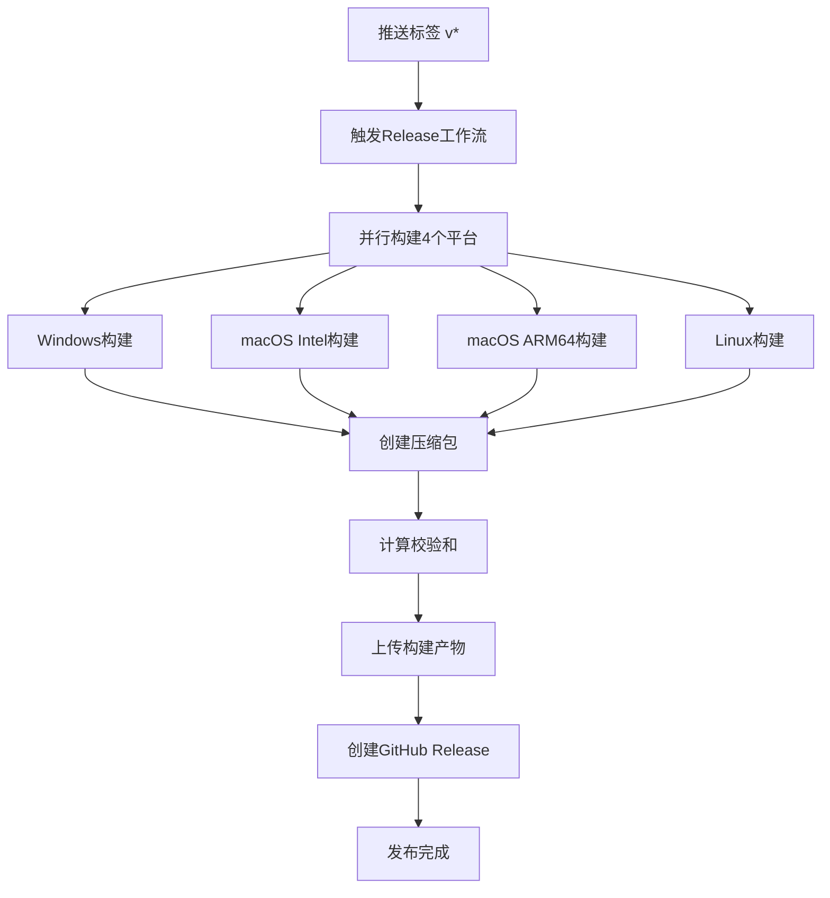

# GitHub Actions CI/CD 设置指南

## 📋 概述

本项目已配置完整的 GitHub Actions CI/CD 流程，支持：
- 🔄 自动化测试 (跨平台、多Python版本)
- 🏗️ 跨平台构建 (Windows/macOS/Linux)
- 📦 自动Release发布
- 🔒 文件校验和生成

## 🚀 使用方法

### 1. 触发Release构建

#### 方法一：推送标签 (推荐)
```bash
# 创建并推送版本标签
git tag v1.0.0
git push origin v1.0.0
```

#### 方法二：手动触发
1. 进入 GitHub 仓库页面
2. 点击 "Actions" 标签
3. 选择 "Build and Release" 工作流
4. 点击 "Run workflow"
5. 输入版本号 (如: v1.0.0)

### 2. 监控构建过程

构建过程包含以下步骤：
1. **多平台构建** (并行执行)
   - Ubuntu (Linux x64)
   - Windows (x64) 
   - macOS (Intel x64)
   - macOS (Apple Silicon ARM64)

2. **自动打包**
   - 创建可执行文件
   - 生成分发包
   - 计算SHA256校验和

3. **创建Release**
   - 自动生成Release Notes
   - 上传所有平台的构建产物
   - 提供下载链接和校验和

## 📁 构建产物

每次Release将生成以下文件：

| 文件名 | 平台 | 说明 |
|--------|------|------|
| `ai-product-selector-win-x64.zip` | Windows x64 | Windows可执行程序包 |
| `ai-product-selector-macos-x64.tar.gz` | macOS Intel | macOS Intel应用程序包 |
| `ai-product-selector-macos-arm64.tar.gz` | macOS Apple Silicon | macOS ARM64应用程序包 |
| `ai-product-selector-linux-x64.tar.gz` | Linux x64 | Linux可执行程序包 |
| `*.sha256` | 所有平台 | SHA256校验和文件 |

## 🔧 配置文件说明

### `.github/workflows/release.yml`
- **主要功能**: 跨平台构建和Release发布
- **触发条件**: 推送v*标签或手动触发
- **构建矩阵**: 4个平台并行构建
- **输出**: 压缩包 + 校验和 + Release

### `.github/workflows/test.yml`
- **主要功能**: 代码测试和构建验证
- **触发条件**: 推送到main/develop分支或PR
- **测试矩阵**: 3个操作系统 × 3个Python版本
- **包含**: 代码检查、单元测试、构建烟雾测试

## ⚙️ 环境要求

### GitHub仓库设置
- ✅ 启用 GitHub Actions
- ✅ 配置 GITHUB_TOKEN (自动提供)
- ✅ 允许工作流创建Release

### 分支保护 (可选但推荐)
```yaml
# 保护main分支
- 要求PR审查
- 要求状态检查通过
- 限制推送权限
```

## 🐛 故障排除

### 常见问题

1. **构建失败 - 依赖安装错误**
   - 检查 `requirements.txt` 是否正确
   - 验证Python版本兼容性

2. **Playwright安装失败**
   - 通常是网络问题，会自动重试
   - 不影响最终构建结果

3. **PyInstaller打包失败**
   - 检查 `build.spec` 配置
   - 确认所有必需模块已包含

4. **Release创建失败**
   - 检查标签格式 (必须以v开头)
   - 确认仓库有创建Release权限

### 调试方法

1. **查看构建日志**
   ```bash
   # 在Actions页面查看详细日志
   GitHub → Actions → 选择失败的工作流 → 查看步骤详情
   ```

2. **本地测试构建**
   ```bash
   # 使用本地构建脚本测试
   python packaging/build.py
   ```

3. **验证PyInstaller配置**
   ```bash
   # 测试spec文件
   python -m PyInstaller build.spec --clean --noconfirm
   ```

## 🔄 工作流程图



## 📝 最佳实践

1. **版本管理**
   - 使用语义化版本 (v1.0.0, v1.1.0, v2.0.0)
   - 预发布版本使用后缀 (v1.0.0-beta.1)

2. **测试策略**
   - 每次PR都会运行完整测试
   - Release前进行构建烟雾测试
   - 支持多Python版本兼容性测试

3. **发布流程**
   - 先合并到main分支
   - 创建标签触发Release
   - 验证所有平台构建成功
   - 测试下载的构建产物

4. **安全考虑**
   - 所有构建产物提供SHA256校验
   - 使用官方GitHub Actions
   - 最小权限原则配置