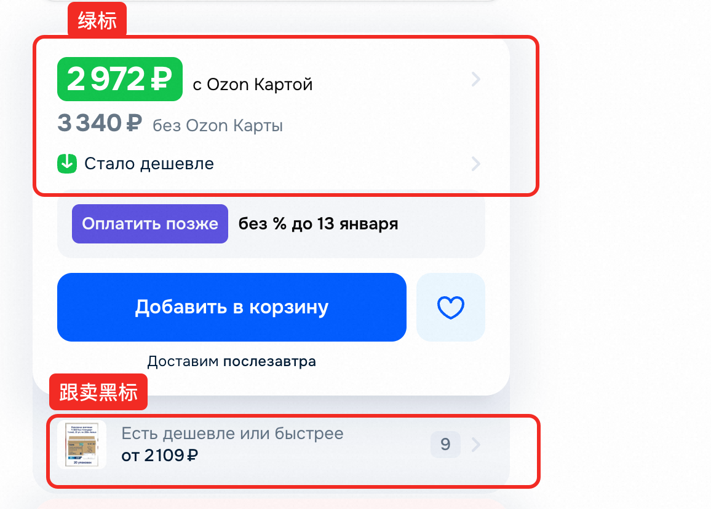
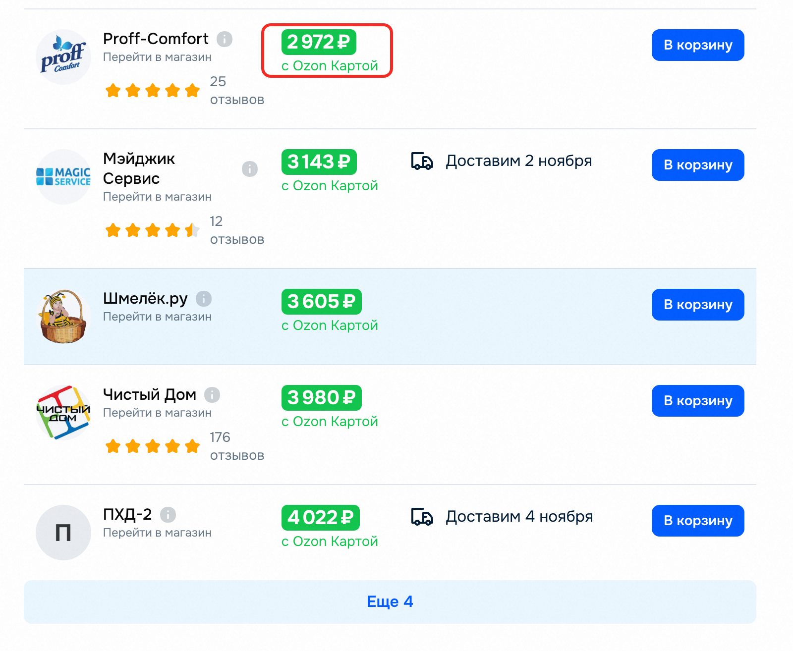
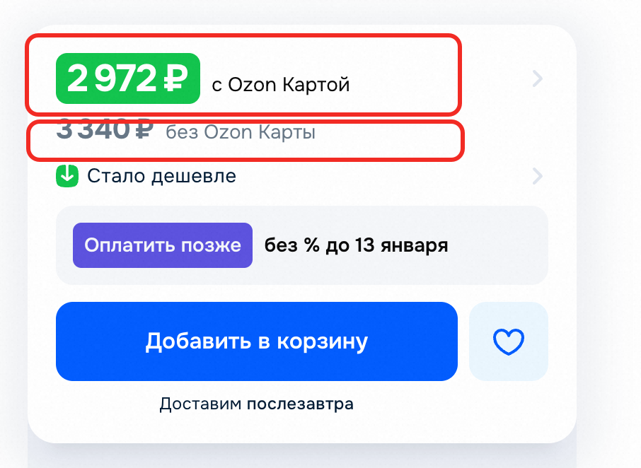
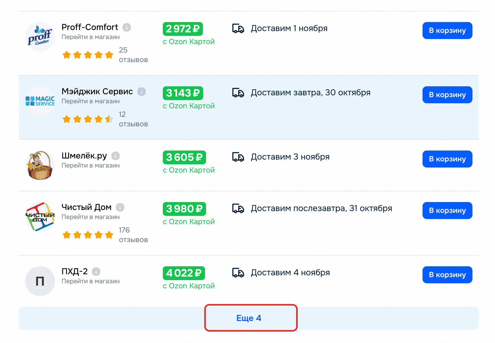
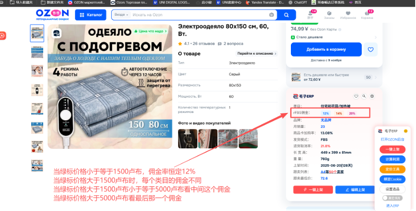
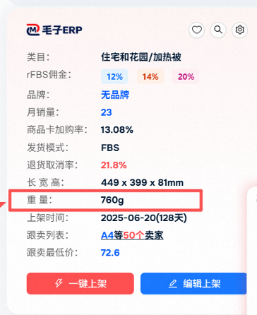
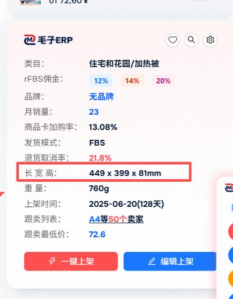

好店筛选需求

1. 读取用户提交表单的excel数据, 包括三列，第一列是”店铺id“, 第二列是“是否为好店（是｜否｜空）“, 第三列为“状态：（已处理｜未处理|空）”
2. 循环读取excel数据,如果状态为“未处理”，则进行以下操作：，否则跳过该店铺
3. 进入 https://seerfar.cn/admin/store-detail.html?storeId=2859833&platform=OZON, 其中store为店铺id
4. 抓取，如下图标红的店铺销售额_30天(sold_30days)、店铺销量_30天、日均销量的数据
   

5. 初筛店铺，根据店铺销售额_30天、店铺销量_30天、日均销量的数据，计算利润筛选店铺，目前要求店铺销售额_30天>50w,
   店铺销量_30天>250单。
   特别注意利润计算的参数值会调整。** 如果不符合要求，第二列标记为“否”，第三列标记为“已处理”，并跳过该店铺 **
6. 循环商品表格，通过抓取商品的信息、以及利润计算器判断店铺是是否需要"裂变"，具体的若前x个产品，有两个以上有利润率大于y%（利润率=利润/备货成本）
    - 商品列表遍历，如下图， 表格第二列包括了商品图片、品牌名称、SKU信息，第三列是类目信息。 如果类目是黑名单内的，则跳过
      
    点击商品图片，进入Ozon的商品详情页，如下图，获取商品绿标价格、黑标、跟卖黑标价格（绿标和黑标价格的解释见）
    ，当绿标不存在的情况下，使用黑标价格对比。
    - 如果跟卖区域不存在，则认为真实的绿、黑标价格为当前商品详情页的绿标，黑标价格，否则进入下面流程
    - 计算真实绿标、黑标价格采集跟卖店铺信息。分两种情况
        - 分支1，如果绿标价格小于等于跟卖价格则,真实的绿标和黑标价格，为当前商品详情页的绿标，黑标价格.采集前N个跟卖店铺信息
        - 分支2， 如果绿标价格大于跟卖黑标价格， 则点击黑标价格，如图所示
          ，页面将弹出跟卖浮层
            - 采集跟卖店铺列表（参考**采集跟卖店铺信息的办法**）
            - 如图点击浮层里的绿标
              页面跳转到商品详情页，获取真实的绿标价格、黑标价格。
        - 采集跟卖店铺信息的办法： 则点击黑标价格，如图所示
          ，页面将弹出跟卖浮层， 首先从浮层里获取前N(默认10)
          个店铺的信息，如果覆层里有 更多的label, 先点击。采集的信息必须包括店铺ID
    - 从毛子ERP插件渲染区域采集并计算佣金率 ,获取商品重量
      、尺寸获取尺寸
        - 佣金率计算参考
    ```
   绿标价格<=1500卢布,佣金率一律为12%，
   大于1500卢布,佣金率不固定，>1500卢布<=5000卢布,选择第二个label里的数字，>5000卢布,选择第三个label里的数字
   ```


7. 商品定价，获取真实定价方式如下
 ```
   只有黑标价格，黑标价格就是真实售价
   黑标价格在90以内的，黑标价格就是真实售价
   黑标价格90-120人民币时,黑标价格+5就是他的真实售价
   黑标价格在120人民币以上，（黑标-绿标）*2.2+黑标就是他的真实售价
 ```

8. 获取货源匹配（略），如果匹配成功，则获得采购价格; 如果匹配失败，则不处理该商品。

9. 通过利润计算器的excel计算利润，输入如图真实的黑标、绿标价格，佣金率、商品重量、商品尺寸、定价、采购成本。
   如果商品利润符合预期（默认>=20%），则为当前的店铺评分+1，并且将跟卖卖家列表输出到excel里，否则不处理。
10. 当前店铺遍历完毕后，如果店铺评分>=2，则将该店铺信息更新为好店，状态更新为已经处理，并输出到excel里
11. 进行下一个店铺的遍历，重复店铺循环，直到任务完结。


 