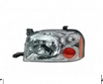
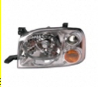
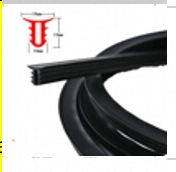
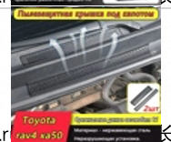
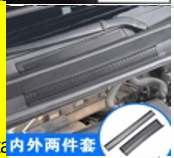

# 图片相似度对比结果表格

**生成时间**: 2025-10-20 15:04:47  
**工具版本**: 图片相似度工具 v1.0  
**对比方法**: 快速模式 (哈希 + SSIM + ORB)

## 对比结果

| 图片1 | 图片2 | 对比结果 |
|-------|-------|----------|
|    `img.png` |    `img_1.png` | **相似度**: 0.7129 (🔵 中等相似)   **计算耗时**: 0.093s   **文件大小**: 28.1 KB vs 31.1 KB   **哈希相似度**: 0.7500   **SSIM相似度**: 0.6572   **ORB特征匹配**: 0.0150 |
|    `img_2.png` |    `img_3.png` | **相似度**: 0.3186 (🔴 低相似)   **计算耗时**: 0.015s   **文件大小**: 68.9 KB vs 34.3 KB   **哈希相似度**: 0.3438   **SSIM相似度**: 0.2810   **ORB特征匹配**: 0.0050 |
|    `img_4.png` |    `img_5.png` | **相似度**: 0.4491 (🔴 低相似)   **计算耗时**: 0.016s   **文件大小**: 70.7 KB vs 60.5 KB   **哈希相似度**: 0.5938   **SSIM相似度**: 0.2320   **ORB特征匹配**: 0.1050 |

## 相似度等级说明

| 等级 | 分数范围 | 说明 | 建议 |
|------|----------|------|------|
| 🟢 极高相似 | >= 0.9 | 可能是重复图片 | 建议去重 |
| 🟡 高相似 | >= 0.8 | 很相似的图片 | 可能是同一商品的不同展示 |
| 🔵 中等相似 | >= 0.65 | 有一定相似性 | 可能是相关商品 |
| 🔴 低相似 | < 0.65 | 相似度较低 | 属于不同类型商品 |

## 算法说明

- **哈希相似度**: 基于感知哈希算法，对图片整体特征进行比较
- **SSIM相似度**: 结构相似性指数，比较图片的亮度、对比度和结构
- **ORB特征匹配**: 基于ORB特征点检测和匹配的相似度

---
*此表格由图片相似度对比工具自动生成*
